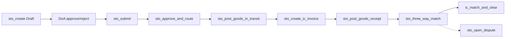
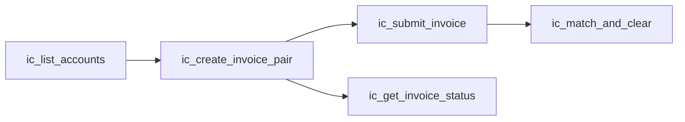

# OpulentAggro STO MCP (41 tools)

MCP server: `erpnext-mcp-server/`. Factory: `create-server.ts` registers **41 tools** (see [tool-registry](../mcp-db-alignment/references/tool-registry.md)).

**Flow coverage map:** [docs/opulentaggro-flow-coverage.mdx](../../docs/opulentaggro-flow-coverage.mdx)

## When to load

- Calling any `sto_*` or `ic_*` MCP tool
- Configuring Cursor MCP (stdio or Vercel HTTP)
- Choosing MCP vs REST vs desk UI
- Trigger terms: **OpulentAggro MCP**, **erpnext-mcp-server**, **sto_create**, **ic_***, **/api/mcp**, **41 tools**, **intercompany automation**

## Architecture

```mermaid
flowchart LR
  Agent[Agent / Cursor] -->|stdio or SSE| MCP[erpnext-mcp-server]
  MCP -->|token auth| ERP[Railway ERPNext]
  Agent -->|optional| Vercel[/api/mcp proxy]
  Vercel --> MCP
  ERP --> UI[Vercel /app/*]
```

| Layer | Local | Hosted |
|-------|-------|--------|
| ERPNext | `http://localhost:8000` | `https://erpnext-production-512a.up.railway.app` |
| Vercel desk | `http://localhost:3000/app/*` | `https://vercel-indol-phi-69.vercel.app/app/*` |
| MCP HTTP | `http://localhost:3000/api/mcp` | `https://vercel-indol-phi-69.vercel.app/api/mcp` |

## Transport

| Mode | Entry | Auth |
|------|-------|------|
| **Stdio** | `erpnext-mcp-server/build/index.js` | `ERPNEXT_API_KEY`+`SECRET` or `ERPNEXT_NO_AUTH=1` (localhost only) |
| **Vercel SSE** | `POST /api/mcp` | ERPNext API token server-side; optional `MCP_AUTH_TOKEN` Bearer |

**Vercel MCP handshake:** Header `Accept: application/json, text/event-stream`. Sequence: `initialize` → `notifications/initialized` → `tools/call`. Responses: SSE `event: message\ndata: {...}`.

**Direct REST (no MCP):** `POST /api/method/erpnext.intercompany.<module>.<method>` — same args as MCP; use when debugging transport.

Load env: `source scripts/load_env.sh` (local) or `source scripts/load_cloud_agent_env.sh` (hosted). **Never commit** credentials.

## Tool groups (41)

| Group | Count | Reference | Primary UI |
|-------|------:|-----------|------------|
| STO lifecycle | 16 | [sto-lifecycle-tools.md](references/sto-lifecycle-tools.md) | `/app/sto-dashboard`, `/app/sto-trace` |
| IC billing | 6 | [ic-billing-tools.md](references/ic-billing-tools.md) | `/app/intercompany/billing` |
| Treasury / clearing | 4 | [ic-extended-tools.md](references/ic-extended-tools.md) | `/app/reconciliation`, trace clearing panel |
| Triangular | 2 | [ic-extended-tools.md](references/ic-extended-tools.md) | `/app/intercompany/triangular` |
| Accrual | 2 | [ic-extended-tools.md](references/ic-extended-tools.md) | `/app/reconciliation` |
| Generic Frappe | 11 | [generic-tools.md](references/generic-tools.md) | `/app/{doctype}` |

### STO lifecycle (`sto_*` × 16)

`sto_create` → `sto_request_approval` → `sto_approve`/`sto_reject` → `sto_submit` → `sto_approve_and_route` → `sto_post_goods_in_transit` → `sto_create_ic_invoice` → `sto_post_goods_receipt` → `sto_three_way_match` → `ic_match_and_clear` (optional) → `sto_get_trace` / `sto_list`. Workflow-lite: `sto_open_dispute`, `sto_resolve_dispute`, `sto_list_disputes`, `sto_generate_booking_advice`.



### IC billing pair



## MCP call pattern (Letta-style)

1. **List tools** — Cursor MCP panel or `tools/list` JSON-RPC
2. **Read schema** — tool `inputSchema` in `sto-tools.ts` / `ic-billing-tools.ts` / `ic-extended-tools.ts`
3. **Call with JSON** — `tools/call` with `name` + `arguments`
4. **Parse response** — JSON in `content[0].text`; errors set `isError: true`
5. **Verify UI** — open Vercel route from tool reference; confirm document name visible

### Harness markers (E2E)

| Marker | Meaning |
|--------|---------|
| `qty: 101` | Main STO chain in `test_all_41_mcp_tools.py` |
| `qty: 102` | UI screenshot `sto_create` in `test_local_mcp_ui_screenshots.sh` |
| `qty: 88` | Hosted UI visibility test (historical) |

**Example — create STO (local MCP):**

```json
{
  "company": "Opulent Fresh NA",
  "supplier": "Internal Supplier Opulent Fresh APAC",
  "items": [{"item_code": "STO-TEST-ITEM-001", "qty": 101, "rate": 100}],
  "submit": false
}
```

**Expected response shape:**

```json
{
  "purchase_order": "PUR-ORD-2026-00070",
  "stage": "Draft",
  "company": "Opulent Fresh NA"
}
```

**UI verify:** `http://localhost:3000/app/sto-dashboard` — row with PO name, Draft badge, qty 101 × $100.

## Agent workflow checklist

Human DoA required before `sto_submit` (unless using `sto_approve` which submits).

```
- [ ] Prerequisites: FY 2026, USD currency, stock ≥150 in APAC/EU/NA Stores, internal supplier
- [ ] sto_create (Draft) — note purchase_order
- [ ] sto_request_approval → sto_approve (or wait for human DoA)
- [ ] sto_submit (docstatus=1)
- [ ] sto_approve_and_route → sto_post_goods_in_transit → sto_create_ic_invoice → sto_post_goods_receipt
- [ ] sto_three_way_match → optional ic_match_and_clear
- [ ] sto_get_trace — confirm stage + SI/PI names (ACC-SINV-*, ACC-PINV-*)
- [ ] Vercel UI: /app/sto-trace?purchase_order={PO}
```

Full chain examples: [workflows.md](references/workflows.md). E2E proof: [opulentaggro-mcp-ui-e2e](../opulentaggro-mcp-ui-e2e/SKILL.md).

## When to use which tool

| Task | Tool |
|------|------|
| STO workflow step | **`sto_*`** |
| Standalone IC AR/AP | **`ic_create_invoice_pair`** or `ic_create_sales_invoice` / `ic_create_purchase_invoice` |
| Treasury match & clear | **`ic_match_and_clear`** (requires submitted linked SI+PI) |
| Triangular sale MVP | **`ic_triangular_sale`** |
| Accrual JE | **`ic_create_accrual`** |
| Read any DocType | `get_document`, `get_documents` |
| Escape hatch | `call_method` — avoid for STO/IC chains |

**Do not** use `create_document` for internal POs — use `sto_create`.

## Setup (stdio)

```bash
cd erpnext-mcp-server && npm install && npm run build
```

```json
{
  "mcpServers": {
    "opulentaggro-sto": {
      "command": "node",
      "args": ["<WORKSPACE>/erpnext-mcp-server/build/index.js"],
      "env": {
        "ERPNEXT_URL": "http://localhost:8000",
        "ERPNEXT_NO_AUTH": "1"
      }
    }
  }
}
```

Replace `<WORKSPACE>` with repo root (note **two spaces** after `FW_`).

## Troubleshooting

See [troubleshooting.md](references/troubleshooting.md) for the **7 fixes** (idempotent `sto_submit`, multi-warehouse stock, bidirectional SI↔PI, etc.) and hosted prerequisites.

| Issue | Quick fix |
|-------|-----------|
| NegativeStockError on GIT | Run `scripts/ensure_hosted_prereqs.py` or `erpnext.intercompany.ensure_hosted_prereqs.run` |
| sto_submit fails on re-run | Idempotent — accept `docstatus=1` |
| ic_match_and_clear fails | Submit both SI and PI; pair must be bidirectionally linked |
| get_document on Vercel | Use valid Customer name, not `Administrator` |
| Tool count mismatch | `./scripts/verify_mcp_alignment.sh` |

## Related skills

| Skill | Role |
|-------|------|
| [opulentaggro-mcp-ui-e2e](../opulentaggro-mcp-ui-e2e/SKILL.md) | MCP + UI test harness, screenshots |
| [opulentaggro-sto-navigation](../opulentaggro-sto-navigation/SKILL.md) | Desk routes, stages, pitfalls |
| [opulentaggro-vercel](../opulentaggro-vercel/SKILL.md) | Vercel deploy, `/api/mcp` proxy |
| [mcp-db-alignment](../mcp-db-alignment/SKILL.md) | Registry SSOT, seed parity |

## Additional resources

- Tool schemas + UI verify columns: [references/sto-lifecycle-tools.md](references/sto-lifecycle-tools.md), [ic-billing-tools.md](references/ic-billing-tools.md), [ic-extended-tools.md](references/ic-extended-tools.md), [generic-tools.md](references/generic-tools.md)
- Workflow order + tolerances: [references/workflows.md](references/workflows.md)
- MCP setup: [docs/erpnext-sto-mcp-setup.md](../../docs/erpnext-sto-mcp-setup.md)
- Skill patterns inspiration: [Letta creating-skills](https://github.com/letta-ai/letta-code/tree/main/src/skills/builtin/creating-skills), [converting-mcps-to-skills](https://github.com/letta-ai/letta-code/tree/main/src/skills/builtin/converting-mcps-to-skills)
