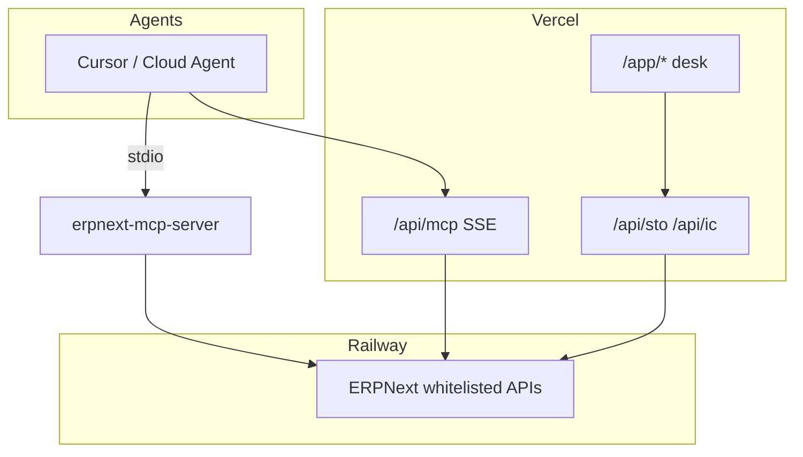

# OpulentAggro Intercompany STO

ERPNext fork + MCP server + Vercel desk for AgroFresh-style intercompany Stock Transfer Orders, IC billing, treasury clearing, triangular sales, and accruals.

## Architecture



Full flow map: [docs/opulentaggro-flow-coverage.mdx](docs/opulentaggro-flow-coverage.mdx)

## Agent skills

Skills follow [Letta creating-skills](https://github.com/letta-ai/letta-code/tree/main/src/skills/builtin/creating-skills) and [converting-mcps-to-skills](https://github.com/letta-ai/letta-code/tree/main/src/skills/builtin/converting-mcps-to-skills) patterns (progressive disclosure, MCP call → verify UI).

| Skill | Path | Purpose |
|-------|------|---------|
| **opulentaggro-sto-mcp** | [.cursor/skills/opulentaggro-sto-mcp/](.cursor/skills/opulentaggro-sto-mcp/SKILL.md) | **Primary** — 41 MCP tools, schemas, transports, workflows |
| **opulentaggro-mcp-ui-e2e** | [.cursor/skills/opulentaggro-mcp-ui-e2e/](.cursor/skills/opulentaggro-mcp-ui-e2e/SKILL.md) | MCP + UI test harness, screenshots, env loading |
| opulentaggro-sto-navigation | [.cursor/skills/opulentaggro-sto-navigation/](.cursor/skills/opulentaggro-sto-navigation/SKILL.md) | Desk routes, STO stages, Frappe REST |
| opulentaggro-vercel | [.cursor/skills/opulentaggro-vercel/](.cursor/skills/opulentaggro-vercel/SKILL.md) | Vercel deploy, API proxies |
| mcp-db-alignment | [.cursor/skills/mcp-db-alignment/](.cursor/skills/mcp-db-alignment/SKILL.md) | Tool registry SSOT, seed parity |
| erpnext-sto-mcp | [.cursor/skills/erpnext-sto-mcp/](.cursor/skills/erpnext-sto-mcp/SKILL.md) | Alias → opulentaggro-sto-mcp |
| mcp-e2e-testing | [.cursor/skills/mcp-e2e-testing/](.cursor/skills/mcp-e2e-testing/SKILL.md) | Alias → opulentaggro-mcp-ui-e2e |

Agent instructions: [AGENTS.md](AGENTS.md)

## MCP (41 tools)

| Group | Count | Examples |
|-------|------:|----------|
| `sto_*` | 16 | `sto_create`, `sto_three_way_match`, `sto_open_dispute` |
| `ic_*` billing | 6 | `ic_create_invoice_pair`, `ic_submit_invoice` |
| `ic_*` extended | 8 | `ic_match_and_clear`, `ic_triangular_sale`, `ic_create_accrual` |
| Generic | 11 | `get_document`, `call_method` |

| Transport | Endpoint | Auth |
|-----------|----------|------|
| Stdio | `erpnext-mcp-server/build/index.js` | `ERPNEXT_API_KEY`+`SECRET` or `ERPNEXT_NO_AUTH=1` (local) |
| Vercel SSE | `/api/mcp` | Server-side API token; optional `MCP_AUTH_TOKEN` |

**Env vars:** `ERPNEXT_URL`, `ERPNEXT_API_KEY`, `ERPNEXT_API_SECRET`, `MCP_AUTH_TOKEN`, `VERCEL_MCP_URL`. Templates: `config/demo-credentials.env.example`, `config/cloud-agent-remote.env.example`.

## Quick start — local MCP + UI test

```bash
cp config/demo-credentials.env.example config/demo-credentials.env
bash -lc 'source scripts/load_env.sh && ./scripts/start_all.sh && cd erpnext-mcp-server && npm run build && cd .. && ./scripts/verify_mcp_alignment.sh && ERPNEXT_NO_AUTH=1 python3 scripts/test_all_41_mcp_tools.py && ./scripts/test_local_mcp_ui_screenshots.sh'
```

- ERPNext: `http://localhost:8000`
- Vercel: `http://localhost:3000`
- MCP: `http://localhost:3000/api/mcp`

## Hosted stack

| Interface | URL |
|-----------|-----|
| Vercel desk | https://vercel-indol-phi-69.vercel.app |
| Vercel MCP | https://vercel-indol-phi-69.vercel.app/api/mcp |
| Railway ERPNext | https://erpnext-production-512a.up.railway.app |

Latest validation: [docs/local-mcp-ui-validation-report.md](docs/local-mcp-ui-validation-report.md) (33/33 PASS local).

## Repo layout

| Path | Purpose |
|------|---------|
| `erpnext/` | ERPNext fork (STO module, Pierre theme) |
| `erpnext-mcp-server/` | MCP server (41 tools) |
| `vercel/` | Next.js desk + API gateway |
| `docs/` | Setup, flow coverage, validation reports |
| `scripts/` | Seed, E2E, alignment |

## Docs

- [docs/opulentaggro-flow-coverage.mdx](docs/opulentaggro-flow-coverage.mdx) — AgroFresh flows → MCP → UI
- [docs/erpnext-sto-mcp-setup.md](docs/erpnext-sto-mcp-setup.md) — MCP + desk setup
- [docs/cloud-agent-mcp-browser-runbook.md](docs/cloud-agent-mcp-browser-runbook.md) — Hosted validation
