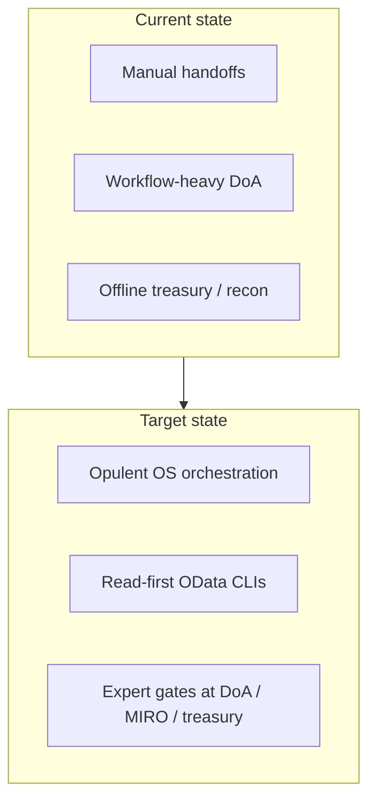
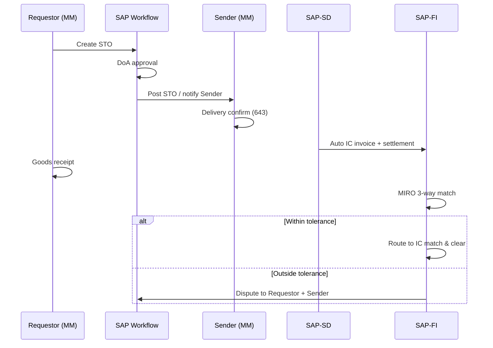
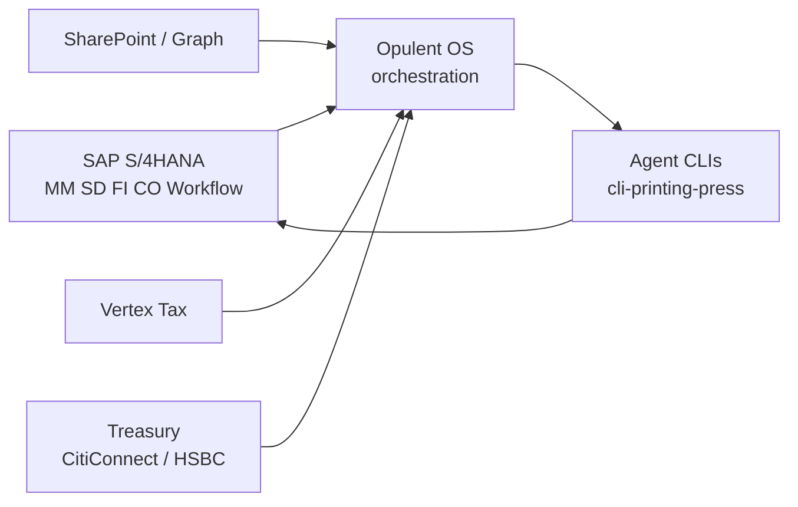

# AgroFresh SAP S/4HANA Intercompany — Engagement Context & Access Requirements

**Client:** AgroFresh  
**Engagement:** Intercompany P2P automation (Opulent OS / agent CLI)  
**Workspace:** `FW_  Intercompany Files/`  
**Last updated:** 2026-05-28  
**Status:** Draft for client confirmation — URLs, tenant topology, and named owners are **TBD** until AgroFresh provides them.

**Related technical docs:**

- [sap-s4hana-fiori-cli-printing-press.md](./sap-s4hana-fiori-cli-printing-press.md) — OData → cli-printing-press, auth, sandbox limits  
- [sap-s4hana-use-cases.md](./sap-s4hana-use-cases.md) — API priorities and agent command patterns  
- [catalog/sap-s4hana-business-partner.yaml](../catalog/sap-s4hana-business-partner.yaml) — example catalog entry  
- [cli-test-results.md](./cli-test-results.md) — sandbox and tooling smoke tests (2026-05-28)

---

## 1. Executive summary

AgroFresh runs **intercompany Procure-to-Pay (P2P)** across multiple legal entities and company codes in **SAP S/4HANA**, spanning **stock transfers (STO)**, **triangular sales**, **annual accrual allocations**, **IC AR/AP matching & clearing (F110)**, and **central reconciliation**. Today these flows depend heavily on **SAP Workflow / DoA**, **automatic IC settlement and FI posting**, **MIRO three-way match**, and **offline treasury / accounting** steps.

The engagement builds **event-driven agent automation** (Opulent OS orchestration) with **read-first SAP OData CLIs** generated via [cli-printing-press](https://github.com/mvanhorn/cli-printing-press), bounded by **DoA, immutable audit logs, and human approval** at judgment-heavy steps (tax, MIRO exceptions, treasury release).


| Milestone                   | Horizon    | Intent                                                                                                                      |
| --------------------------- | ---------- | --------------------------------------------------------------------------------------------------------------------------- |
| **Week 1 POC**              | ~1 week    | Sandbox or narrow dev tenant access, representative transactions, **named owners**, traceable outputs (no “demo-only” stop) |
| **Six-week implementation** | ~6 weeks   | Proof → controlled production hardening without outrunning finance controls                                                 |
| **Three extension tiers**   | Tier 1 → 3 | Tier 1 proves cross-functional spine; Tiers 2–3 add tax (Vertex), SharePoint evidence, treasury gateways                    |


**Primary outcome (from Keynote blueprint):** one observable operating flow from **request → shipment → settlement → match/clear → evidence**, with repetitive coordination automated and **fiduciary controls preserved**.




---

## 2. Business context

### 2.1 Source materials


| Source                    | Path                                                                | Content used                                                          |
| ------------------------- | ------------------------------------------------------------------- | --------------------------------------------------------------------- |
| Keynote blueprint         | `agrofresh-intercompany-p2p-automation-blueprint.key`               | Operating thesis, tiers, ecosystem, BEFORE/AFTER automation, controls |
| P2P business requirements | `AgroFresh P2P_Business_Requirements_Intercompany_v1_05202026.docx` | End-to-end IC narratives, workflow gates, dispute routing             |
| IC transaction map        | `AgroFresh P2P_Intecompany_Transactions_v1_05122026.docx`           | Module ownership (MM/SD/FI/CO), MIRO, movement type 643, IDoc         |
| Process flow PDFs         | `Intercompany Transaction Processing (Stock Transfers               | Triangular Sales                                                      |
| SAP CLI docs              | `docs/sap-s4hana-*.md`, `catalog/sap-s4hana-business-partner.yaml`  | API matrix, auth patterns, catalog blueprint                          |


*No separate exported PDF/PPTX of the Keynote was found in the workspace; slide text was recovered via Keynote unzip + `strings` on `Index/*.iwa`, cross-checked against docx sources.*

### 2.2 Business objective

AgroFresh needs **one operating flow** across request, shipment, invoicing, IC settlement, and treasury touchpoints—replacing approval-centered handoffs and month-end hunts with **agent-run transaction loops** where rules are clear, while **experts retain approval** on exceptions, tax, and treasury release.

The Keynote frames each of the five IC processes with **BEFORE / AFTER** automation: agents handle repeatable coordination; humans retain **DoA**, **tax judgment**, and **treasury release**.

### 2.3 Entities and roles (process swimlanes)


| Role                    | Typical actions                                           | SAP area          |
| ----------------------- | --------------------------------------------------------- | ----------------- |
| **Requestor**           | Creates STO; posts GR; resolves disputes                  | MM                |
| **Sender / Supplier**   | Delivery confirmation, goods in transit (643), IC invoice | MM / SD           |
| **Seller**              | Customer sales order (triangular), customer invoice       | SD                |
| **Receiver**            | IC allocation notification (accruals)                     | FI / CO           |
| **Provider**            | Accrual capture, CO allocation adjustment                 | FI / CO           |
| **Accounts Payable**    | MIRO, tolerance, dispute                                  | FI                |
| **Accounting**          | IC AR/AP auto-post, reconciliation (offline)              | FI                |
| **Treasury**            | Cash need (offline), F110, bank transfer (manual portal)  | FI + bank systems |
| **Tax**                 | Withholding / VAT on accruals (manual judgment)           | Tax / Vertex      |
| **Customer** (external) | Triangular sales counterparty                             | SD                |


Company codes, plants, and **partner company code** relationships are configuration prerequisites (blueprint references **WRCOMPANY / 025** pattern—confirm exact AgroFresh config names).

### 2.4 Intercompany process catalog

#### Process 1 — Stock transfers (STO)

**Source:** Business requirements docx + transaction map + Stock Transfers PDF.


| Step                                         | Owner              | System                            | Automation notes                                  |
| -------------------------------------------- | ------------------ | --------------------------------- | ------------------------------------------------- |
| Create & code STO                            | Requestor          | SAP-MM                            | DoA workflow; reject → park → return to requestor |
| Approve & post STO                           | Approver           | SAP-MM + Workflow                 | Approved → posted → routed to Sender              |
| Delivery confirmation / goods **in transit** | Sender             | SAP-MM                            | Movement type **643**                             |
| Auto IC invoice                              | System             | SAP-SD + Workflow                 | Triggers IC settlement                            |
| Auto IC AR/AP                                | Accounting         | SAP-FI                            | Settlement posting                                |
| GR by requestor                              | Requestor          | SAP-MM                            | Enables 3-way match                               |
| 3-way match STO / GR / IC invoice            | System             | SAP-FI (MIRO)                     | Qty/price tolerances; GR/IR enforced              |
| Match → IC match & clear path                | Workflow           | —                                 | See matching process                              |
| No match → dispute                           | Requestor + Sender | SAP Workflow                      | Routed for resolution                             |
| Booking advice / BOL                         | Sender             | PDF from delivery (not LE module) | SharePoint archive target in blueprint            |





#### Process 2 — Triangular sales

**Source:** Business requirements docx + transaction map + Triangular Sales PDF.


| Step                                          | Owner      | System                       | Automation notes               |
| --------------------------------------------- | ---------- | ---------------------------- | ------------------------------ |
| Customer SO with **plant in another country** | Seller     | SAP-SD                       | DoA; reject → seller revision  |
| Sender fulfillment & delivery posting         | Sender     | SAP-MM                       | Goods issued; BOL via workflow |
| Booking advice BOL / packing slip             | Sender     | PDF output from delivery doc | Not using LE module            |
| Customer invoice                              | Seller     | SAP-SD                       | External customer billing      |
| IC invoice                                    | Supplier   | SAP-SD                       | IC billing                     |
| Auto IC AR/AP                                 | Accounting | SAP-FI                       | Same settlement pattern as STO |
| IC match & clear                              | Finance    | FI / workflow                | See matching process           |


#### Process 3 — Accrual allocations (annual)

**Source:** Business requirements docx + transaction map + Accrual Allocations PDF.


| Accrual types                        | Loans, royalties, management fees, interest, R&D (cost-plus)             |
| ------------------------------------ | ------------------------------------------------------------------------ |
| Tax withholding                      | **Manual** — prepared by Tax team; Vertex enrichment in Tier 2           |
| Provider captures accruals           | SAP-FI                                                                   |
| Receiver notified                    | Workflow                                                                 |
| CO: IC accrual allocation adjustment | SAP-CO; DoA                                                              |
| Post adjustment + IC AR/AP           | SAP-FI (workflow); settlement via **IDoc** interface per transaction doc |
| Payment / clear                      | F110 path may follow allocation notification                             |


#### Process 4 — Matching & clearing

**Source:** Business requirements docx + Matching & Clearing PDF.


| Step                                         | Owner                       | System                       | Automation notes                                  |
| -------------------------------------------- | --------------------------- | ---------------------------- | ------------------------------------------------- |
| Determine funds to transfer                  | Finance / Treasury / Region | **Offline**                  | Cash needs not fully represented in OData         |
| IC payment run                               | Treasury                    | SAP-FI **F110**              | Treasury executes in SAP                          |
| Auto match & clear paying/receiving entities | System                      | SAP-FI                       | Cleared IC AP (paying) + IC AR (receiving)        |
| Bank transfer                                | Treasury                    | **Manual** in banking system | CitiConnect / HSBC per blueprint; ISO 20022 files |


#### Process 5 — Reconciliation


| Step                           | Owner      | System      | Automation notes                                           |
| ------------------------------ | ---------- | ----------- | ---------------------------------------------------------- |
| Central IC reconciliation      | Accounting | **Offline** | Performed centrally                                        |
| Investigate unreconciled items | Accounting | **Offline** | Agent can **read** open items + JE; resolution stays human |


### 2.5 Pain points (current state → target)


| Pain point                        | Evidence                                                | Target (blueprint)                                                      |
| --------------------------------- | ------------------------------------------------------- | ----------------------------------------------------------------------- |
| Cross-entity coordination latency | Triangular sales: seller → sender → BOL → dual invoices | Agent-controlled fulfillment & billing **spine**                        |
| Approval-heavy STO path           | Multiple workflow handoffs per business requirements    | Observable steps before financial post; agent loop with DoA gates       |
| MIRO tolerance breaks             | Invoice blocked outside tolerance; dispute routing      | Structured exception queues; bounded automation                         |
| Offline treasury selection        | Cash needs determined offline                           | Monitored agent execution with **explicit treasury release** governance |
| Month-end reconciliation hunt     | Central offline reconciliation                          | Open-item reads + `PartnerCompanyCode` JE queries; exception export     |
| Document evidence scattered       | BOL/booking advice PDFs                                 | SharePoint archive + Graph upload proof                                 |
| Tax complexity on accruals        | Manual withholding                                      | Vertex enrichment; tax specialist approval                              |


### 2.6 Timeline and phasing (from Keynote)


| Tier (blueprint) | Scope (indicative)                                                                                                                     | Credential scope                                |
| ---------------- | -------------------------------------------------------------------------------------------------------------------------------------- | ----------------------------------------------- |
| **Tier 1**       | SAP OData read (+ limited write where approved), Workflow/Fiori task visibility, STO or triangular **read path**, immutable audit logs | Comm user: read scenarios only                  |
| **Tier 2**       | Vertex tax, SharePoint evidence, MIRO exception handling                                                                               | Add `SAP_COM_0057`, Graph app, Vertex keys      |
| **Tier 3**       | Treasury API / F110 prep, ISO 20022 file generation, bank gateway (CitiConnect or HSBC)                                                | Treasury credentials; **explicit release gate** |


---

## 3. Meaningful context for agents / CLI

Agents must treat SAP as **system of record**—not bypass posting, DoA, or treasury release.

### 3.1 What agents need to know to operate safely


| Concept                            | Agent implication                                                                      |
| ---------------------------------- | -------------------------------------------------------------------------------------- |
| **IC is cross-module**             | A single STO spans MM (643, GR), SD (IC invoice), FI (settlement, MIRO)                |
| **AUTO steps are workflow-driven** | IC invoice and AR/AP auto-post are triggered by SAP Workflow—not arbitrary OData POST  |
| **Partner company code**           | Primary IC reconciliation signal in FI OData (`PartnerCompanyCode` on JE lines)        |
| **No monolithic IC API**           | Agents compose reads from BP, PO, billing, JE, supplier invoice services               |
| **Offline steps exist**            | Treasury cash selection and central recon are **not** fully API-exposed today          |
| **Evidence artifacts**             | BOL/booking advice are PDF outputs; archive proof lives in SharePoint (Tier 2)         |
| **Movement type 643**              | Goods in transit between IC entities—key MM signal for stock transfer automation       |
| **MIRO tolerances**                | Configurable qty/price bands; outside tolerance → blocked invoice + dispute workflow   |
| **F110**                           | Payment run for IC match/clear; treasury-owned; Tier 3 at earliest for automation prep |
| **WRCOMPANY / 025**                | Blueprint reference for partner company configuration—confirm AgroFresh naming         |


### 3.2 Recommended agent workflows (read-first)


| Workflow                    | OData services                                           | Output                                          |
| --------------------------- | -------------------------------------------------------- | ----------------------------------------------- |
| **Resolve trading partner** | `API_BUSINESS_PARTNER`                                   | BP ID, customer/supplier roles per company code |
| **Trace STO / PO**          | `API_PURCHASEORDER_PROCESS_SRV` or `API_PURCHASEORDER_2` | Header, items, confirmations                    |
| **IC reconciliation slice** | `API_JOURNALENTRYITEMBASIC_SRV`                          | Lines where `PartnerCompanyCode ne ''`          |
| **Document-level GL**       | `API_OPLACCTGDOCITEMCUBE_SRV`                            | Accounting document + item keys                 |
| **IC billing status**       | `API_BILLING_DOCUMENT_SRV`                               | Billing type, payer, company code               |
| **Triangular SO inquiry**   | `API_SALES_ORDER_SRV`                                    | Header/items; plant in foreign country          |
| **Supplier invoice / MIRO** | `API_SUPPLIERINVOICE_PROCESS_SRV`                        | Read first; write only with policy              |


### 3.3 Orchestration surfaces (blueprint)




Event-driven design: each automation step should be **observable** (state, evidence, reason code) before the next financial post.

---

## 4. Agent / CLI safety

### 4.1 Hard rules (non-negotiable)


| Rule                                   | Rationale                                                                     |
| -------------------------------------- | ----------------------------------------------------------------------------- |
| **No `API_INTERCOMPANY_`* assumption** | No such dedicated OData service exists; compose from finance/procurement APIs |
| **Sandbox GET-only**                   | `sandbox.api.sap.com` rejects writes and CSRF mutations                       |
| **DoA is authoritative**               | Agents **prepare**; approvers act via Workflow/Fiori inbox                    |
| **MIRO write = high risk**             | Supplier invoice create/post requires `SAP_COM_0057` + explicit policy        |
| **Treasury release is governed**       | F110 execution and bank portal payment stay human-approved in early tiers     |
| **No blind posting**                   | Blueprint: agents must not post FI without validated predecessor state        |
| **Immutable audit trail**              | Log actor, payload hash, timestamp, status, retry history                     |
| **Credential scope is phase-specific** | Tier 1 read keys ≠ Tier 3 treasury keys                                       |


### 4.2 Safe automation boundaries


| Allowed early (Tier 1)        | Deferred (Tier 2+)        | Never without sign-off      |
| ----------------------------- | ------------------------- | --------------------------- |
| BP / PO / JE **read**         | Vertex tax calculation    | Unapproved FI posting       |
| Workflow task **read** status | SharePoint archive upload | F110 execution              |
| Open-item / billing **read**  | MIRO auto-post            | Bank portal payment release |
| Exception **classification**  | OData MM write (STO post) | IDoc replay / mass change   |
| Recon exception **export**    | ISO 20022 file generation | Production write on Day 1   |


### 4.3 CSRF and mutation checklist

Before any POST/PATCH/DELETE against a tenant (not sandbox):

1. `GET` entity or `$metadata` with header `X-CSRF-Token: Fetch`
2. Capture `X-CSRF-Token` response header and `Set-Cookie`
3. Include token + cookies on mutating request
4. Verify Communication Arrangement active for target scenario
5. Confirm change ticket / functional sign-off for production

### 4.4 Exception handling contract

When agents encounter ambiguity (tolerance breach, missing BOL, mapper gap, unsupported API):

1. **Stop** — do not compensate with manual FI posting
2. **Classify** — reason code from agreed taxonomy
3. **Queue** — route to Requestor, Sender, AP, or Tax per process doc
4. **Log** — immutable record with document references
5. **Learn** — expert correction loop feeds runbook updates (blueprint)

---

## 5. Required systems


| System                               | Role in engagement                                      | Cloud vs on-prem                                     |
| ------------------------------------ | ------------------------------------------------------- | ---------------------------------------------------- |
| **SAP S/4HANA**                      | Core ERP (MM, SD, FI, CO, Workflow)                     | **TBD** — confirm with AgroFresh                     |
| **SAP Fiori**                        | DoA approvals, IC apps, Communication Arrangement setup | Same tenant as S/4                                   |
| **SAP Gateway / OData**              | API exposure for agents                                 | On-prem: `/sap/opu/odata/sap/`; Cloud: V2 + V4 paths |
| **SAP Business Accelerator Hub**     | Spec download, sandbox Try Out                          | `https://api.sap.com/`                               |
| **Communication Management** (Cloud) | Comm users, OAuth, scenarios                            | Fiori — required for tenant API access               |
| **SAP Workflow / SWF**               | DoA, IC auto steps                                      | Task APIs / Fiori inbox — **confirm exposed APIs**   |
| **Vertex** (or equivalent)           | Tax calculation / enrichment on accruals                | External — **TBD**                                   |
| **Microsoft SharePoint + Graph**     | BOL / booking advice archive                            | `DriveItem` upload proof in blueprint                |
| **Bank gateways**                    | CitiConnect or HSBC                                     | Treasury tier; ISO 20022                             |
| **Opulent OS**                       | Multi-system orchestration, agent runtime               | Opulent-managed                                      |
| **cli-printing-press**               | OData → typed CLI for agents                            | Generated per service catalog                        |


### 5.1 SAP modules and integration objects


| Module       | IC relevance                     | APIs / interfaces                                                                                 |
| ------------ | -------------------------------- | ------------------------------------------------------------------------------------------------- |
| **MM**       | STO, movement 643, GR, delivery  | PO OData; stock movement APIs **TBD by release**                                                  |
| **SD**       | SO, customer invoice, IC billing | `API_SALES_ORDER_SRV`, `API_BILLING_DOCUMENT_SRV`                                                 |
| **FI**       | IC AR/AP, MIRO, F110, open items | `API_JOURNALENTRYITEMBASIC_SRV`, `API_OPLACCTGDOCITEMCUBE_SRV`, `API_SUPPLIERINVOICE_PROCESS_SRV` |
| **CO**       | Accrual allocation adjustments   | `API_PROFITCENTER_SRV`, `API_COSTCENTER_SRV`; CO postings may be workflow-only                    |
| **Workflow** | DoA, auto IC invoice/settlement  | Task/decision endpoints — **confirm with basis**                                                  |
| **IDoc**     | Accrual IC settlement            | Named in transaction doc — read-only monitoring first                                             |


### 5.2 Priority OData services (agent CLI)


| Priority | Service                                      | Hub overview                                                                 | Communication scenario | Use case                         |
| -------- | -------------------------------------------- | ---------------------------------------------------------------------------- | ---------------------- | -------------------------------- |
| P0       | `API_BUSINESS_PARTNER`                       | [overview](https://api.sap.com/api/API_BUSINESS_PARTNER/overview)            | `SAP_COM_0008`         | Trading partner / org BP         |
| P0       | `API_PURCHASEORDER_PROCESS_SRV`              | [overview](https://api.sap.com/api/API_PURCHASEORDER_PROCESS_SRV/overview)   | `SAP_COM_0053`         | STO / PO inquiry (OData V2)      |
| P0       | `API_PURCHASEORDER_2`                        | [overview](https://api.sap.com/api/API_PURCHASEORDER_2/overview)             | `SAP_COM_0053`         | PO inquiry (OData V4 strategic)  |
| P0       | `API_JOURNALENTRYITEMBASIC_SRV`              | [overview](https://api.sap.com/api/API_JOURNALENTRYITEMBASIC_SRV/overview)   | FI read scenario       | IC recon by `PartnerCompanyCode` |
| P0       | `API_OPLACCTGDOCITEMCUBE_SRV`                | [overview](https://api.sap.com/api/API_OPLACCTGDOCITEMCUBE_SRV/overview)     | FI analytical          | Document-level GL                |
| P1       | `API_SUPPLIERINVOICE_PROCESS_SRV`            | [overview](https://api.sap.com/api/API_SUPPLIERINVOICE_PROCESS_SRV/overview) | `SAP_COM_0057`         | MIRO / accrual P2P               |
| P1       | `API_BILLING_DOCUMENT_SRV`                   | [overview](https://api.sap.com/api/API_BILLING_DOCUMENT_SRV/overview)        | `SAP_COM_0120`         | IC billing docs                  |
| P1       | `API_SALES_ORDER_SRV`                        | Search hub “Sales Order”                                                     | SD scenario            | Triangular SO (e.g. SO03)        |
| P2       | `API_PRODUCT_SRV` / material stock           | Hub search                                                                   | MM                     | Stock transfer materials         |
| P2       | `API_PROFITCENTER_SRV`, `API_COSTCENTER_SRV` | [profit center](https://api.sap.com/api/API_PROFITCENTER_SRV/overview)       | `SAP_COM_0087`         | Allocation validation            |


Full command patterns: [sap-s4hana-use-cases.md](./sap-s4hana-use-cases.md).

---

## 6. Access & credentials

### 6.1 SAP API Hub (development / spec)


| Item                  | Owner                                                                     | Notes                                                    |
| --------------------- | ------------------------------------------------------------------------- | -------------------------------------------------------- |
| **SAP ID** (personal) | Each engineer                                                             | Login to download OpenAPI/EDMX                           |
| `**SAP_APIHUB_KEY`**  | Developer profile at [showApiKey](https://api.sap.com/profile/showApiKey) | Header `apikey` for `sandbox.api.sap.com` — **GET only** |


### 6.2 SAP S/4 tenant (AgroFresh)


| Item                                        | Purpose                      | Provisioning                                  |
| ------------------------------------------- | ---------------------------- | --------------------------------------------- |
| **Tenant base URL** `SAP_S4_BASE_URL`       | All OData calls              | Basis / solution manager                      |
| **Communication User** + password           | Basic auth for Gateway OData | Fiori → Communication Users                   |
| **Communication Arrangement** per API       | Authorize OData scenarios    | Functional + basis                            |
| **OAuth 2.0 client** (if Cloud + XSUAA/IAS) | Production-grade agents      | Security team                                 |
| **Business user(s) for Workflow**           | DoA test paths               | Requestor, approver, treasury test identities |
| **Fiori app authorizations**                | IC apps, inbox, comm mgmt    | Security / role `SAP_BR`_* per process        |
| **CSRF-enabled session**                    | POST/PATCH/DELETE            | Implemented in CLI for mutating calls         |


#### Communication scenarios (minimum P0/P1 set)


| Scenario       | Typical service                                         | Phase           |
| -------------- | ------------------------------------------------------- | --------------- |
| `SAP_COM_0008` | `API_BUSINESS_PARTNER`                                  | Tier 1          |
| `SAP_COM_0053` | `API_PURCHASEORDER_PROCESS_SRV` / `API_PURCHASEORDER_2` | Tier 1          |
| `SAP_COM_0057` | `API_SUPPLIERINVOICE_PROCESS_SRV`                       | Tier 2 (writes) |
| `SAP_COM_0120` | `API_BILLING_DOCUMENT_SRV`                              | Tier 1 read     |
| `SAP_COM_0087` | `API_PROFITCENTER_SRV`                                  | Tier 2          |


### 6.3 Network


| Requirement                 | Notes                                                        |
| --------------------------- | ------------------------------------------------------------ |
| VPN or corporate network    | Common for on-prem S/4                                       |
| TLS to Gateway              | Port/host whitelist                                          |
| Egress from Opulent runtime | If agents run outside AgroFresh network — **early decision** |
| SAP Cloud Connector         | May be required for Cloud/private-link topologies            |


### 6.4 Non-SAP systems


| System                           | Credentials                                            | Owner                     | Phase  |
| -------------------------------- | ------------------------------------------------------ | ------------------------- | ------ |
| **Microsoft Graph / SharePoint** | App registration, sites/libraries scoped to IC archive | AgroFresh IT / M365 admin | Tier 2 |
| **Vertex**                       | API keys / environment URLs                            | Tax + integration team    | Tier 2 |
| **CitiConnect / HSBC**           | Treasury API credentials, ISO 20022 signing            | Treasury + bank IT        | Tier 3 |


### 6.5 Environment variables (CLI catalog pattern)

```bash
export SAP_S4_BASE_URL="https://{tenant-host}"
export SAP_COMMUNICATION_USER="{comm_user}"
export SAP_COMMUNICATION_PASSWORD="{secret}"
export SAP_APIHUB_KEY="{hub_sandbox_key}"   # sandbox only
# Optional OAuth:
# export SAP_OAUTH_CLIENT_ID=...
# export SAP_OAUTH_CLIENT_SECRET=...
# export SAP_OAUTH_TOKEN_URL=...
```

---

## 7. Environment matrix


| Environment         | Base URL (pattern)                            | OData writes       | Auth              | Data                       | Owner              |
| ------------------- | --------------------------------------------- | ------------------ | ----------------- | -------------------------- | ------------------ |
| **API Hub sandbox** | `https://sandbox.api.sap.com/s4hanacloud/...` | **No**             | `apikey` header   | Generic sample BP/PO       | Engineering        |
| **AgroFresh Dev**   | `https://{dev-host}` **TBD**                  | Limited, CSRF      | Comm user / OAuth | Masked or subset           | Basis              |
| **AgroFresh QA**    | `https://{qa-host}` **TBD**                   | As per test policy | Comm user / OAuth | Representative IC cases    | Basis + Functional |
| **AgroFresh Prod**  | `https://{prod-host}` **TBD**                 | Change-controlled  | OAuth preferred   | Real entities — read-first | Security + Sponsor |


**Sandbox smoke URL (Business Partner):**

```http
GET https://sandbox.api.sap.com/s4hanacloud/sap/opu/odata/sap/API_BUSINESS_PARTNER/A_BusinessPartner?$top=1&$format=json
Header: apikey: {SAP_APIHUB_KEY}
```

**Confirm with AgroFresh:** single vs multiple tenants, Cloud **region** URL, and whether IC config is replicated in dev/QA.

---

## 8. Data dependencies

### 8.1 Master data


| Object                                               | Why required                                  | Confirm with client                                                                                                        |
| ---------------------------------------------------- | --------------------------------------------- | -------------------------------------------------------------------------------------------------------------------------- |
| **Business Partner** (org, customer, supplier roles) | IC trading partners                           | BP numbers per company code                                                                                                |
| **Company codes**                                    | Posting context                               | Full IC matrix                                                                                                             |
| **Plants**                                           | STO / triangular plant routing                | Cross-country sending plant                                                                                                |
| **Materials**                                        | STO lines                                     | Material numbers per plant                                                                                                 |
| **GL accounts**                                      | JE reconciliation                             | IC clearing accounts                                                                                                       |
| **Cost centers / profit centers**                    | Accruals, supplier invoice account assignment | Explicit profit center on invoice lines ([KBA 3377659](https://userapps.support.sap.com/sap/support/knowledge/en/3377659)) |
| **Partner company code**                             | IC due-to/due-from                            | Config equivalent to **WRCOMPANY / 025**                                                                                   |


### 8.2 Process configuration


| Config / master                 | Processes affected         |
| ------------------------------- | -------------------------- |
| IC billing types / doc types    | STO, triangular            |
| DoA rules & workflow templates  | All IC flows               |
| MIRO tolerances (qty/price)     | Stock transfer 3-way match |
| Movement type **643**           | Goods in transit           |
| Payment methods / F110 variants | Matching & clearing        |
| Vertex tax procedures           | Accrual allocations        |
| IDoc types for IC settlement    | Accrual allocations        |


### 8.3 Test data (Week 1 POC)

Blueprint calls for **specific test cases**. AgroFresh should provide:


| Case                             | Modules         | Expected agent behavior                  |
| -------------------------------- | --------------- | ---------------------------------------- |
| Clean STO end-to-end             | MM → SD → FI    | Read path aligns with posted docs        |
| Triangular SO with foreign plant | SD → MM         | SO + delivery + dual invoice trace       |
| MIRO inside tolerance            | FI              | Invoice unblocked; route to clear        |
| MIRO outside tolerance           | FI              | Dispute queue; no auto-post              |
| Parked / rejected STO            | MM + Workflow   | Read parked status; no write             |
| Open IC pair for recon           | FI              | `PartnerCompanyCode` filter returns pair |
| Sample accrual allocation        | CO → FI         | CO adjustment + IDoc settlement visible  |
| BOL archive defect               | MM + SharePoint | Tier 2: missing doc flagged              |


---

## 9. People & approvals


| Function                         | Responsibility                          | Engagement need                        |
| -------------------------------- | --------------------------------------- | -------------------------------------- |
| **Executive sponsor**            | Scope, tier gates, prod access approval | Sign-off on automation boundaries      |
| **Finance / Accounting owner**   | IC policy, recon rules, F110            | Define match/clear policies for agents |
| **P2P / AP lead**                | MIRO, disputes                          | Tolerance & exception runbooks         |
| **Treasury**                     | Cash needs, F110, bank release          | Tier 3 gateway access                  |
| **Tax**                          | Withholding on accruals                 | Vertex rules + manual gates            |
| **SAP Functional (MM/SD/FI/CO)** | Process design, Fiori apps              | Workflow + IC config workshops         |
| **SAP Basis / Security**         | Comm arrangements, OAuth, network       | **Primary access grantors**            |
| **Integration / middleware**     | IDoc, Vertex, bank                      | Interface specs                        |
| **Microsoft 365 admin**          | SharePoint site, Graph app              | Archive path ACLs                      |
| **Opulent delivery**             | CLI generation, orchestration, audit    | Implementation                         |


**Communication Arrangement owner** is typically **Basis + functional** (Fiori setup); document the named contact per environment.

---

## 10. Completion checklist

Use as definition of “engagement complete” for the **automation blueprint phase** (adjust SOW if different).

### 10.1 Access & platform

- Confirmed S/4 topology (**Cloud vs on-prem**, URLs for Dev/QA/Prod)
- Communication Users and Arrangements active for **P0 OData services**
- OAuth or Basic auth working from Opulent runtime (network path proven)
- API Hub specs vendored; **cli-printing-press** catalog entries generated for P0 services
- Sandbox smoke test passed (`API_BUSINESS_PARTNER` minimum)

### 10.2 CLI & agent readiness (P0)

- `sap-s4hana-business-partner` CLI: list/get against **AgroFresh QA**
- `sap-s4hana-purchase-order` CLI: STO-linked PO retrieved
- `sap-s4hana-journal-entry` CLI: IC lines filtered by `PartnerCompanyCode`
- CSRF flow documented/tested for **one** mutating call in QA (if in scope)
- Agent runbook: read-only default, exception export format agreed

### 10.3 Process proof (Tier 1)

- One **stock transfer** or **triangular** case traced: OData reads align with FI documents
- Workflow task status visible (API or agreed alternative)
- Immutable audit log sample reviewed by sponsor
- DoA rejection / park path demonstrated (read or scripted test)

### 10.4 Tier 2–3 (if in SOW)

- SharePoint upload proof for BOL/booking advice
- Vertex enrichment on sample accrual (read or calculate-only)
- Treasury: F110 **read/prepare** only; bank release still manual with log

### 10.5 Governance

- Security review of credential storage (no secrets in repo)
- Indirect access / licensing acknowledged by AgroFresh
- Production read access approved (writes gated by change process)
- Open questions log reviewed with client

---

## 11. Risks & blockers


| Risk                                   | Impact                               | Mitigation                                                    |
| -------------------------------------- | ------------------------------------ | ------------------------------------------------------------- |
| **Tenant topology unknown**            | Wrong API paths (V2 vs V4)           | Confirm release + `$metadata` from tenant                     |
| **Sandbox GET-only**                   | False confidence on writes           | Plan QA tenant for CSRF/mutation tests                        |
| **Missing Communication Arrangements** | 403 on all OData                     | Basis checklist per `SAP_COM_`*                               |
| **No Workflow OData**                  | Cannot automate DoA visibility       | Fiori inbox API alternative or RPA fallback (document)        |
| **IC posting via workflow only**       | Agents cannot “complete” IC in POC   | Scope Tier 1 to read + exception queue                        |
| **API version drift**                  | Hub spec ≠ installed support package | Download live `$metadata`                                     |
| **Indirect access licensing**          | Legal/commercial blocker             | AgroFresh SAP account team review                             |
| **Treasury/bank in Tier 3**            | Schedule slip                        | Keep F110/bank manual until Tier 1–2 stable                   |
| **Vertex / tax judgment**              | Automation must not auto-withhold    | Human tax approval on accruals                                |
| **SharePoint ACLs**                    | PII / doc leakage                    | Dedicated library, least privilege                            |
| **Catalog spec not vendored**          | cli-printing-press generate blocked  | EDMX → OpenAPI in `catalog/specs/` (see cli-test-results)     |
| **Disk / tooling on dev machines**     | Cannot install printing-press        | Free space; use release binary                                |
| **Expert correction loop**             | Model drift                          | Production design learns from labeled corrections (blueprint) |


---

## 12. Open questions

Gaps requiring **AgroFresh confirmation** (15 client confirmations):


| #   | Question                                                                                                             |
| --- | -------------------------------------------------------------------------------------------------------------------- |
| 1   | S/4HANA **Cloud vs on-premise**? Release / support package?                                                          |
| 2   | Exact **tenant URLs** for Dev, QA, Production?                                                                       |
| 3   | Full **company code / partner company code** matrix for IC?                                                          |
| 4   | List of **Fiori apps** used for IC (app IDs) and whether **Workflow task OData** is enabled?                         |
| 5   | Which **Communication Scenarios** (`SAP_COM_0008`, `0053`, `0057`, `0120`, `0087`) are already activated vs net-new? |
| 6   | Preferred auth for agents: **Basic comm user** vs **OAuth 2.0**?                                                     |
| 7   | Can Opulent agents run **inside** corporate network, or need **Cloud Connector / IP allowlist**?                     |
| 8   | Representative **STO / SO document numbers** for Week 1 POC?                                                         |
| 9   | **Vertex** product, endpoints, and which accrual types are in scope for automation?                                  |
| 10  | **SharePoint** site/library URL and retention policy for BOL/archive?                                                |
| 11  | **CitiConnect vs HSBC** (or both) for treasury tier?                                                                 |
| 12  | Is **IDoc** monitoring sufficient for accrual settlement, or IDoc creation required?                                 |
| 13  | **Material stock / goods movement OData** available on installed release for 643 / GR?                               |
| 14  | Named **owners** for: Basis, MM/SD/FI functional, Treasury, Tax, Security (per blueprint “named owners”)?            |
| 15  | **Production** scope for engagement end: read-only vs approved write list?                                           |


---

## Appendix A — Keynote extraction summary

**File:** `agrofresh-intercompany-p2p-automation-blueprint.key` (unzipped; no separate PDF/PPTX in workspace)


| Topic           | Extracted content                                                                                                           |
| --------------- | --------------------------------------------------------------------------------------------------------------------------- |
| Title           | AgroFresh Intercompany P2P Automation Blueprint                                                                             |
| Header          | AGROFRESH INC. / INTERCOMPANY AUTOMATION                                                                                    |
| Confidentiality | CONFIDENTIAL — not for external distribution                                                                                |
| Processes       | Stock Transfers, Triangular Sales, Accrual Allocations, Netting and Clearing, Reconciliation — each with **BEFORE / AFTER** |
| Thesis          | One flow: request → shipment → settlement; event-driven orchestration; DoA preserved                                        |
| Platform        | SAP MM/SD/FI/CO, Workflow, OData/Gateway, Fiori inbox                                                                       |
| Ecosystem       | SharePoint (Graph), Vertex tax, CitiConnect/HSBC, Opulent OS orchestration                                                  |
| Phasing         | Week 1 POC; six-week implementation; three extension tiers                                                                  |
| Controls        | Immutable logs (actor, hash, timestamp, retries); expert correction loop; treasury release governed                         |
| Technical hints | Movement type 643; MIRO; F110; ISO 20022; WRCOMPANY/025; STO create in MM                                                   |


---

## Appendix B — Immediate requests (kickoff)

Align with blueprint **IMMEDIATE REQUESTS** and **TIER 1 ACCESS**:

1. SAP API Hub login + sandbox API key for engineering.
2. AgroFresh **Dev or QA** Communication User + arrangements for `API_BUSINESS_PARTNER`, `API_PURCHASEORDER_PROCESS_SRV`, `API_JOURNALENTRYITEMBASIC_SRV`.
3. Named **functional + basis + security** contacts (see §9).
4. Sample **company codes, plants, BP, STO/SO numbers** for test cases (see §8.3).
5. Confirmation whether **Workflow task API** is exposed to external consumers.
6. SharePoint **site URL** (if Tier 2 in initial SOW).

---

*Document prepared from workspace materials and existing SAP CLI docs. Update URLs, names, and checkboxes as AgroFresh responds to open questions.*