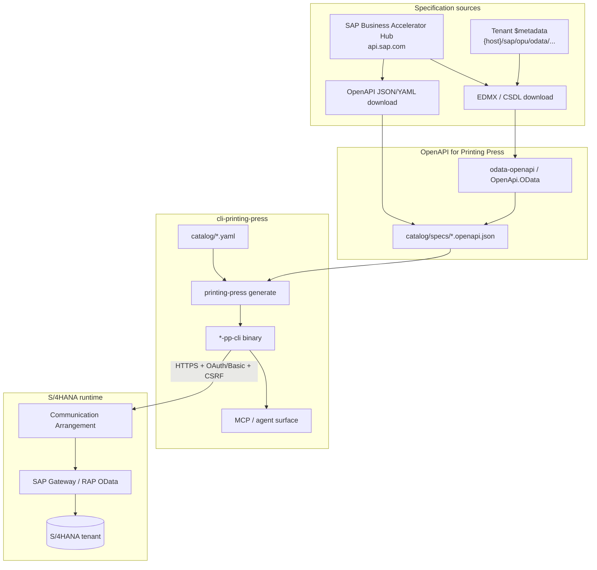

# SAP S/4HANA & Fiori APIs for cli-printing-press

**Audience:** Engineers building agent CLIs for intercompany / finance automation (e.g. AgroFresh P2P) using [cli-printing-press](https://github.com/mvanhorn/cli-printing-press).

**Last updated:** 2026-05-28

---

## Executive summary

SAP S/4HANA exposes **5,000+ APIs** on the [SAP Business Accelerator Hub](https://api.sap.com/) (formerly API Business Hub). Most integration-relevant services are **OData V2 or V4** consumed by Fiori apps and middleware—not classic REST OpenAPI vendors like Stripe or Twilio.

**cli-printing-press** generates CLIs from **OpenAPI 3.0** (`yaml` / `json`). SAP publishes OpenAPI JSON/YAML for many hub APIs **after login**, and always publishes **EDMX/CSDL** for OData. The practical path is:

1. Download **OpenAPI** from the hub when available, **or** convert **EDMX → OpenAPI** (`odata-openapi`, Microsoft.OpenApi.OData).
2. Vendor the converted spec under `catalog/specs/` (cli-printing-press convention) with a stable `https://raw.githubusercontent.com/...` URL.
3. Generate with `printing-press generate <spec-url>`; set **`base_url`** in the catalog entry because every S/4HANA tenant has its own host.
4. Start with **read-only** GET surfaces (Business Partner, journal lines, PO query); treat **writes** as a second phase (CSRF, Communication Arrangements, sandbox is GET-only).

---

## Architecture



---

## cli-printing-press requirements (summary)

| Requirement | SAP implication |
|-------------|-----------------|
| `spec_format`: `yaml`, `json`, or `custom` | Prefer hub **JSON** or converted OpenAPI 3.0 |
| `spec_url` must be `https://` | Host specs in repo `catalog/specs/` → raw GitHub URL |
| `openapi_version`: `"3.0"` | Match converted output (3.0.2 typical) |
| `category` / `tier` enums | Use `sales-and-crm`, `payments`, or `other`; `tier: official` when spec is SAP-published |
| `base_url` | **Required pattern** for SAP: spec `servers` are often sandbox placeholders |
| `auth_env_vars` | Declare tenant credential vars (see catalog example) |
| `auth_key_url` / `auth_instructions` | Point to Communication User / OAuth setup docs |
| Wrapper-only entries | Use only if no spec; SAP OData should **not** be wrapper-only if goal is generation |
| Embedded catalog | One service per entry is the norm; compound “SAP ERP” CLI needs merged OpenAPI (advanced) |

**References:** [CATALOG.md](https://github.com/mvanhorn/cli-printing-press/blob/main/docs/CATALOG.md), [ARTIFACTS.md](https://github.com/mvanhorn/cli-printing-press/blob/main/docs/ARTIFACTS.md), [SPEC-EXTENSIONS.md](https://github.com/mvanhorn/cli-printing-press/blob/main/docs/SPEC-EXTENSIONS.md).

---

## SAP API landscape

### Business Accelerator Hub

| Portal | URL | Notes |
|--------|-----|-------|
| Hub home | https://api.sap.com/ | Search APIs, Try Out, download specs (login required for download) |
| S/4HANA Cloud OData V4 list | https://api.sap.com/products/SAPS4HANACloud/apis/ODATAV4 | Strategic APIs (RAP) |
| S/4HANA on-prem OData V2 package | https://api.sap.com/package/S4HANAOPAPI/odata | Legacy Gateway services |
| Cloud sandbox (Try Out) | https://sandbox.api.sap.com/s4hanacloud/... | **GET only**; header `apikey: <key>` from hub profile |

### OData V2 vs V4

| Aspect | OData V2 (Gateway) | OData V4 (RAP) |
|--------|-------------------|----------------|
| Path pattern | `/sap/opu/odata/sap/{SERVICE}/` | `/sap/opu/odata4/sap/{service}/srvd_a2x/sap/{binding}/{version}/` |
| Default format | Atom/XML; JSON with `Accept: application/json` | JSON |
| Status | Maintenance for existing APIs | All **new** APIs since ~2023 |
| Fiori | Older Fiori / Gateway apps | Fiori elements, annotations (`com.sap.vocabularies.UI.v1`) |
| Filtering on `$expand` | **No** inline `$filter` on expansions | Supported |
| Writes | CSRF + often MERGE via POST | PATCH, `$batch` (JSON) |

### Fiori consumption model

Fiori apps do not call arbitrary REST endpoints—they bind to **OData services** annotated for UI:

- **List / object pages:** OData entity sets + UI annotations (`LineItem`, `Identification`, etc.).
- **Actions:** OData **actions/functions** (V4) or function imports (V2).
- **Draft / RAP:** V4 services support draft handling; agents should prefer stable released APIs on the hub.

Agents mirroring Fiori should use the **same OData service name** listed on the hub (e.g. `API_BUSINESS_PARTNER`), not UI-internal CDS names.

### API categories (hub organization)

| Domain | Example services | Agent value |
|--------|------------------|-------------|
| Finance / GL | `API_JOURNALENTRYITEMBASIC_SRV`, `API_OPLACCTGDOCITEMCUBE_SRV` | Intercompany reconciliation, JE inquiry |
| Sales | `API_SALES_ORDER_SRV`, `API_BILLING_DOCUMENT_SRV` | Order-to-cash, intercompany billing docs |
| Procurement | `API_PURCHASEORDER_PROCESS_SRV`, `API_PURCHASEORDER_2` | P2P, PO status |
| Master data | `API_BUSINESS_PARTNER`, `API_PRODUCT_SRV`, `API_PROFITCENTER_SRV` | Trading partners, materials, CO |
| HR | SuccessFactors OData (separate hub product) | Out of scope for core S/4 IC P2P |

### Authentication

| Method | Typical use | Printing Press / CLI notes |
|--------|-------------|----------------------------|
| **OAuth 2.0** (XSUAA / IAS) | S/4HANA Cloud production | Preferred; client credentials or principal propagation |
| **HTTP Basic** | On-prem dev/test, communication user | Map via `auth_env_vars` or spec security scheme |
| **X.509 / mTLS** | High-security on-prem | Custom transport; not in default catalog |
| **API key** | Hub **sandbox only** | Header `apikey`; not for real tenant |
| **CSRF** | All **mutating** Gateway OData | `GET` with `X-CSRF-Token: Fetch` → use token + cookies on POST/PATCH/DELETE |

**Communication Arrangements** (Cloud): APIs return **403** until the scenario (e.g. `SAP_COM_0008`) is assigned to the communication user used by the CLI.

---

## Downloading specifications

### From SAP Business Accelerator Hub (official)

1. Log in at https://api.sap.com/
2. Open the API (e.g. [Business Partner (A2X)](https://api.sap.com/api/API_BUSINESS_PARTNER/overview))
3. **API Resources → API Specification**
4. Download **EDMX** (OData) and/or **JSON/YAML** (OpenAPI) when offered
5. Optional: **Try Out** against sandbox (read-only)

Guide: [SAP Cloud SDK – Download specs from Business Hub](https://sap.github.io/cloud-sdk/docs/js/guides/api-business-hub-download-specification)

### Programmatic catalog listing

| Package | Purpose |
|---------|---------|
| `@sap/apihub-service-provider` | `getListODataServices()`, `getMetadata()` for hub exploration |
| `@sap/apihub-enterprise-service-provider` | API Business Hub **Enterprise** destinations |
| `@sap/service-provider-apis` | Generic service provider metadata/annotations |

Use these to **discover** service names; generation still needs a downloaded or converted OpenAPI file.

### Live tenant metadata (instance-specific)

Replace `{host}` with your system URL:

```http
GET https://{host}/sap/opu/odata/sap/API_BUSINESS_PARTNER/$metadata
Authorization: Basic {user}:{password}
Accept: application/xml
```

V4 example (Purchase Order):

```http
GET https://{host}/sap/opu/odata4/sap/api_purchaseorder_2/srvd_a2x/sap/purchaseorder/0001/$metadata
```

Use live `$metadata` when hub version ≠ installed support package.

---

## OpenAPI vs OData-only

| Source | Printing Press ready? | Action |
|--------|----------------------|--------|
| Hub OpenAPI JSON | **Yes** | Vendor to `catalog/specs/`, set `servers` / `base_url` |
| Hub EDMX only | **No** (direct) | Convert with `odata-openapi` |
| Live `$metadata` | **No** (direct) | Export XML → convert |
| Pre-generated SAP Cloud SDK VDM | N/A (Java/TS libs) | Not a Printing Press spec |

### OData → OpenAPI conversion

```bash
npm install -g odata-openapi

# After downloading API_BUSINESS_PARTNER.edmx from hub (logged in):
odata-openapi3 API_BUSINESS_PARTNER.edmx \
  --host your-s4-host.example.com \
  --scheme https \
  --basePath /sap/opu/odata/sap/API_BUSINESS_PARTNER \
  -o catalog/specs/sap-api-business-partner.openapi3.json
```

Post-process the OpenAPI file:

- Set `servers[0].url` to a **placeholder** or sandbox; override with catalog `base_url:` at generation time.
- Trim unused entity sets if the CLI surface is too large (optional manual edit).
- Add [`x-auth-env-vars`](https://github.com/mvanhorn/cli-printing-press/blob/main/docs/SPEC-EXTENSIONS.md) if not using catalog `auth_env_vars`.

Alternatives: [Microsoft.OpenApi.OData](https://github.com/microsoft/OpenAPI.NET.OData), [Azure odata-openapi-converter](https://github.com/Azure-Samples/odata-openapi-converter), web converter https://aka.ms/ODataOpenAPI

---

## API catalog (starter set)

| Service | Hub overview | OData path (typical) | Ver | Read | Write | Auth |
|---------|--------------|----------------------|-----|------|-------|------|
| `API_BUSINESS_PARTNER` | https://api.sap.com/api/API_BUSINESS_PARTNER/overview | `/sap/opu/odata/sap/API_BUSINESS_PARTNER/` | V2 | Yes | Yes | Basic/OAuth + CSRF |
| `API_PURCHASEORDER_2` | https://api.sap.com/api/API_PURCHASEORDER_2/overview | `/sap/opu/odata4/sap/api_purchaseorder_2/srvd_a2x/sap/purchaseorder/0001/` | V4 | Yes | Yes (limits) | Basic/OAuth + CSRF |
| `API_PURCHASEORDER_PROCESS_SRV` | https://api.sap.com/api/API_PURCHASEORDER_PROCESS_SRV/overview | `/sap/opu/odata/sap/API_PURCHASEORDER_PROCESS_SRV/` | V2 | Yes | Yes | Basic/OAuth + CSRF |
| `API_JOURNALENTRYITEMBASIC_SRV` | https://api.sap.com/api/API_JOURNALENTRYITEMBASIC_SRV/overview | `/sap/opu/odata/sap/API_JOURNALENTRYITEMBASIC_SRV/` | V2 | Yes | Limited | Basic/OAuth |
| `API_OPLACCTGDOCITEMCUBE_SRV` | https://api.sap.com/api/API_OPLACCTGDOCITEMCUBE_SRV/overview | `/sap/opu/odata/sap/API_OPLACCTGDOCITEMCUBE_SRV/` | V2 | Yes | No | Basic/OAuth |
| `API_BILLING_DOCUMENT_SRV` | https://api.sap.com/api/API_BILLING_DOCUMENT_SRV/overview | `/sap/opu/odata/sap/API_BILLING_DOCUMENT_SRV/` | V2 | Yes | Cancel/PDF | Basic/OAuth + CSRF |
| `API_SUPPLIERINVOICE_PROCESS_SRV` | https://api.sap.com/api/API_SUPPLIERINVOICE_PROCESS_SRV/overview | `/sap/opu/odata/sap/API_SUPPLIERINVOICE_PROCESS_SRV/` | V2 | Yes | Yes | Basic/OAuth + CSRF |
| `API_PROFITCENTER_SRV` | https://api.sap.com/api/API_PROFITCENTER_SRV/overview | `/sap/opu/odata/sap/API_PROFITCENTER_SRV/` | V2 | Yes | No | `SAP_COM_0087` |
| `API_COSTCENTER_SRV` | https://api.sap.com/api/API_COSTCENTER_SRV/overview | `/sap/opu/odata/sap/API_COSTCENTER_SRV/` | V2 | Yes | No | CO scenario |

### Practical spec URLs (verified patterns)

| Artifact | URL pattern | Access |
|----------|-------------|--------|
| Hub API page | `https://api.sap.com/api/{SERVICE_NAME}/overview` | Public browse; download needs login |
| Hub resource | `https://api.sap.com/api/{SERVICE_NAME}/resource` | Often 401 without session |
| Sandbox entity | `https://sandbox.api.sap.com/s4hanacloud/sap/opu/odata/sap/API_BUSINESS_PARTNER/A_BusinessPartner?$top=1` | `apikey` header |
| Sample EDMX (community) | https://raw.githubusercontent.com/SAP-archive/teched2020-IIS360/main/app/test-resources/api-hub/API_BUSINESS_PARTNER.edmx | Public; convert to OpenAPI |
| Tenant metadata | `https://{host}/sap/opu/odata/sap/API_BUSINESS_PARTNER/$metadata` | Tenant credentials |

---

## How to print a SAP S/4HANA CLI (step-by-step)

### 1. Pick one OData service

For AgroFresh-style **intercompany P2P**, start with **read-only**:

1. `API_BUSINESS_PARTNER` — vendor / customer orgs  
2. `API_PURCHASEORDER_PROCESS_SRV` or `API_PURCHASEORDER_2` — PO lines  
3. `API_JOURNALENTRYITEMBASIC_SRV` or `API_OPLACCTGDOCITEMCUBE_SRV` — GL lines with `PartnerCompanyCode`

### 2. Obtain OpenAPI 3.0

- **Preferred:** Hub → API Specification → **JSON** → save as `catalog/specs/sap-api-business-partner.openapi.json`
- **Else:** Download EDMX → `odata-openapi3` as above

### 3. Add catalog entry

Copy `catalog/sap-s4hana-business-partner.yaml` (this workspace) into cli-printing-press `catalog/`, update `spec_url` to your raw GitHub spec URL.

### 4. Configure base URL and auth

```bash
export SAP_S4_BASE_URL="https://my-s4.example.com"
export SAP_COMMUNICATION_USER="MY_API_USER"
export SAP_COMMUNICATION_PASSWORD="***"
# Or OAuth token vars per your IdP
```

Run generation:

```bash
printing-press generate https://raw.githubusercontent.com/<org>/cli-printing-press/main/catalog/specs/sap-api-business-partner.openapi.json
```

Use catalog mode if embedded:

```bash
printing-press generate sap-s4hana-business-partner --from-catalog
```

(Exact flag names: see project README.)

### 5. Smoke test (read)

```bash
# Sandbox (hub API key)
curl -s -H "apikey: $SAP_APIHUB_KEY" \
  "https://sandbox.api.sap.com/s4hanacloud/sap/opu/odata/sap/API_BUSINESS_PARTNER/A_BusinessPartner?\$top=1&\$format=json"

# Tenant
curl -s -u "$SAP_COMMUNICATION_USER:$SAP_COMMUNICATION_PASSWORD" \
  -H "Accept: application/json" \
  "$SAP_S4_BASE_URL/sap/opu/odata/sap/API_BUSINESS_PARTNER/A_BusinessPartner?\$top=1"
```

### 6. Enable writes (later)

1. `GET .../$metadata` or any entity with `X-CSRF-Token: Fetch`
2. Capture `X-CSRF-Token` response header and `Set-Cookie`
3. `POST`/`PATCH` with token + cookies
4. Test on **non-sandbox** tenant (hub sandbox rejects writes / CSRF for POST)

---

## Limitations and gotchas

| Topic | Detail |
|-------|--------|
| **Instance URLs** | No global `api.sap.com` production host—every CLI needs configurable `base_url` |
| **Sandbox** | Read-only GET; POST/PATCH fail CSRF or “not allowed” |
| **CSRF + cookies** | Generated CLI must implement fetch-token flow for mutations (may need Printing Press extensions or post-gen patch) |
| **Communication scenarios** | Cloud APIs 403 until arrangement activated (e.g. `SAP_COM_0008`, `SAP_COM_0053`, `SAP_COM_0120`) |
| **Licensing** | API use follows S/4HANA license + indirect access rules; hub Try Out ≠ production rights |
| **Payload size** | Large OData services → huge OpenAPI; consider trimming or separate CLIs per domain |
| **V2 vs V4 PO** | `API_PURCHASEORDER_2` missing some partner POST scenarios (SAP KBA 3722233)—verify for your release |
| **Journal entry keys** | `A_JournalEntryItemBasic` uses generated analytical `ID`; filter by company/year/JE fields, not business key alone |
| **Intercompany** | No single `API_INTERCOMPANY_*`; use billing + JE APIs + `PartnerCompanyCode` fields |

---

## Intercompany-specific recommendations

Aligned with workspace materials (AgroFresh P2P intercompany: triangular sales, matching/clearing, stock transfers, accruals):

| Process need | Recommended APIs | Query hints |
|--------------|------------------|-------------|
| Trading partner resolution | `API_BUSINESS_PARTNER` | `$filter=BusinessPartnerCategory eq '2'` (org) |
| PO / P2P document status | `API_PURCHASEORDER_PROCESS_SRV`, `API_PURCHASEORDER_2` | `$expand=to_PurchaseOrderItem` |
| GL / IC posting lines | `API_JOURNALENTRYITEMBASIC_SRV`, `API_OPLACCTGDOCITEMCUBE_SRV` | `$filter=PartnerCompanyCode ne ''` |
| Billing / IC invoice | `API_BILLING_DOCUMENT_SRV` | Billing type / company code filters |
| Supplier invoice accrual | `API_SUPPLIERINVOICE_PROCESS_SRV` | Explicit `ProfitCenter` / `CostCenter` in payload |
| CO master | `API_PROFITCENTER_SRV`, `API_COSTCENTER_SRV` | Read-only master sync |

Fiori apps such as **Generate Intercompany Billing Request** drive process steps that may **not** map 1:1 to a single OData POST—agents should combine OData reads with documented process APIs or RPA only after functional sign-off.

---

## Recommended catalog strategy for cli-printing-press

| Approach | When |
|----------|------|
| **One catalog entry per OData service** | Default; matches hub boundaries and Communication Arrangements |
| **Compound “sap-s4hana-finance” CLI** | Only after merging OpenAPI with clear tags; high maintenance |
| **`spec_source: official`** | Hub-downloaded or converted from SAP EDMX |
| **`spec_source: docs`** | Hand-trimmed spec documented in PR |
| **`tier: official`** | SAP-published API definitions |
| **`category: other`** | ERP catch-all when not CRM/payments |

See companion: [sap-s4hana-use-cases.md](./sap-s4hana-use-cases.md) and [catalog/sap-s4hana-business-partner.yaml](../catalog/sap-s4hana-business-partner.yaml).

---

## References

- [cli-printing-press CATALOG.md](https://github.com/mvanhorn/cli-printing-press/blob/main/docs/CATALOG.md)
- [SAP Cloud SDK – Download hub specifications](https://sap.github.io/cloud-sdk/docs/js/guides/api-business-hub-download-specification)
- [OpenAPIs in the SAP ecosystem (SAP Community)](https://community.sap.com/t5/technology-blog-posts-by-sap/openapis-in-the-sap-ecosystem/ba-p/13535569)
- [S/4HANA Cloud sandbox on API Hub](https://community.sap.com/t5/enterprise-resource-planning-blog-posts-by-sap/s-4hana-cloud-sandbox-is-now-available-in-sap-api-business-hub/ba-p/13308837)
- [odata-openapi (OASIS)](https://oasis-tcs.github.io/odata-openapi/lib/)
